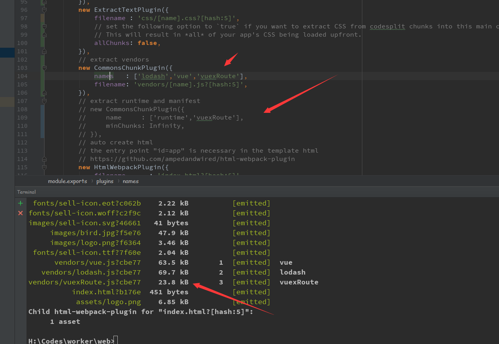
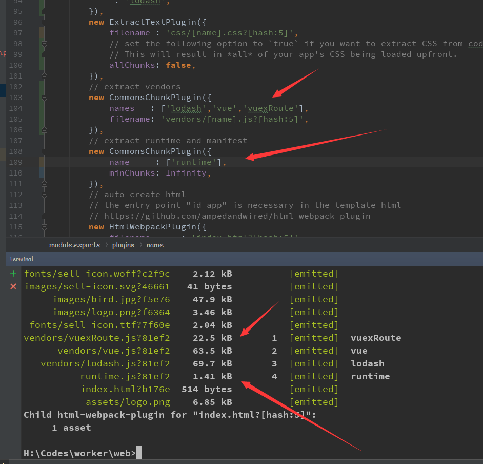
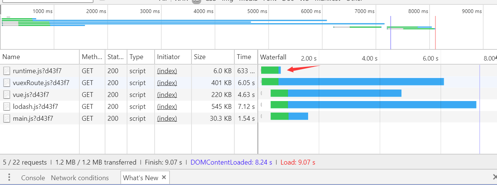
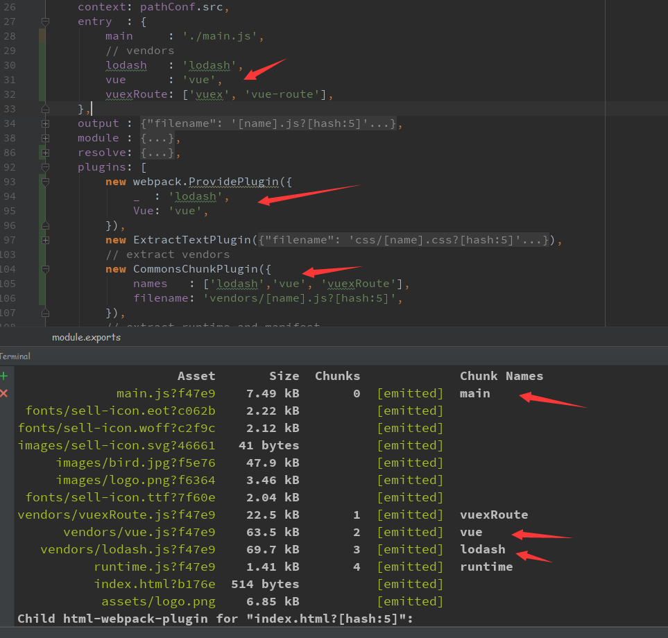
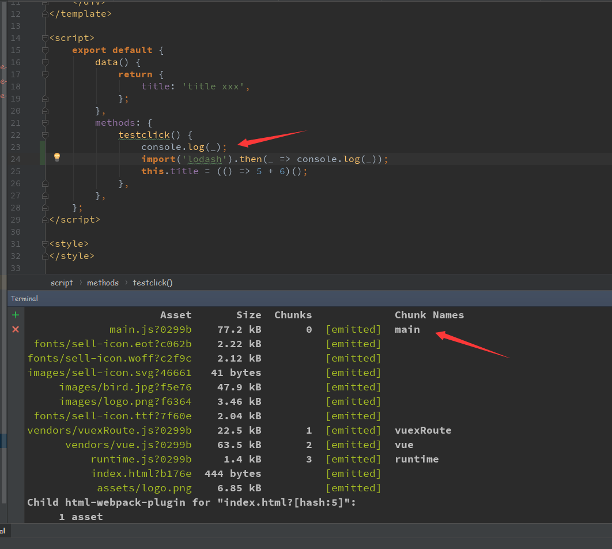
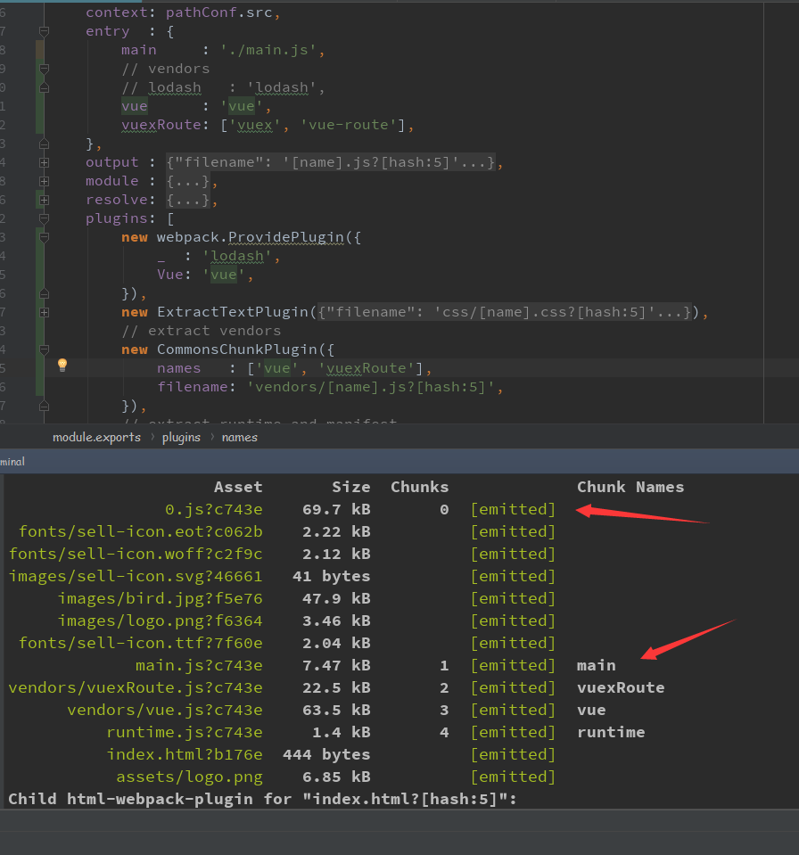
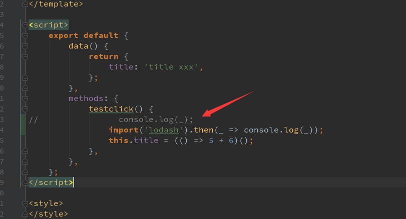

# CommonChunkPlugin
## runtime会合并到最后的一个names值中

runtime in

runtime out

## runtime会优先于所有的代码加载

## 直接在entry中引入模块，配合CommonChunkPlugin做代码分离，分离后的代码会在首屏并行加载，但却会阻塞页面渲染
页面在lodash.js加载完毕后才展示

## 模块打包的优先级
* 先看entry + CommonChunkPlugin中单独打出的吗？有则按该规矩来

* 再看webpack.ProvidePlugin中有没有设置全局模块？有则忽略动态引用

* 最后动态引用

